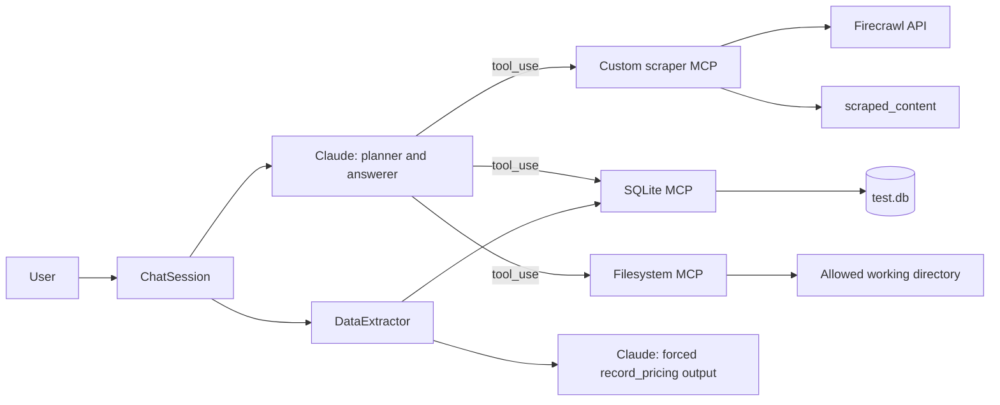
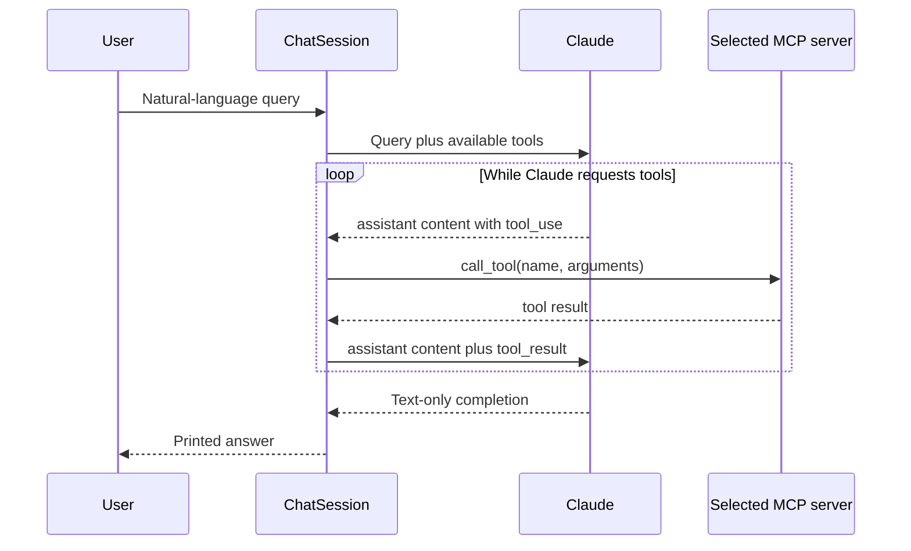

# MCP In Action: Maintainer Handover Guide

This guide is the operating manual for the AI engineer taking ownership of this project. Read the 10-minute mental model first, then use the remaining sections as a reference when debugging or extending the system.

## 1. System Purpose and Boundaries

The project is an MCP-powered research chatbot for comparing LLM inference-provider pricing. It:

1. Uses Anthropic Claude to interpret natural-language requests and choose MCP tools.
2. Scrapes provider pages through a custom FastMCP server backed by Firecrawl.
3. Persists raw markdown, HTML, and scrape metadata on disk.
4. Uses a second, schema-constrained Claude call to extract numeric token pricing.
5. Persists accepted pricing plans through an SQLite MCP server.
6. Exposes a filesystem MCP server to demonstrate a three-server agent workflow.

This is an educational, local-first system. It is not yet a production crawler, durable data pipeline, or multi-user service.

### Current non-goals

- Cross-session or cross-query conversational memory
- Guaranteed extraction from JavaScript-only or authenticated pricing tables
- Automatic cache expiry and background refresh
- Deduplicated or historically versioned pricing
- Production-grade database migrations
- Safe execution of arbitrary untrusted tools in a hosted environment

## 2. Ten-Minute Mental Model

There are two kinds of LLM interaction and three MCP servers. The primary planner interaction loops until tool use is complete; the structured-extraction interaction can run once per provider.



The responsibilities are deliberately split:

- **Claude chooses runtime tools and writes the user-facing answer.**
- **`ChatSession` owns the tool loop, routing, and query-level state.**
- **`Server` owns MCP process lifecycle, retries, and timeouts.**
- **`starter_server.py` owns scraping and raw-artifact persistence.**
- **`DataExtractor` owns structured validation and database writes.**

The main design rule is: **the model proposes actions, but deterministic code enforces storage and validation boundaries.**

## 3. Quick Start and Working-Directory Requirement

All child-server commands and storage paths are resolved relative to the process working directory. Run the project from its own directory:

```powershell
cd projects/02_mcp_in_action
uv sync
uv run python .\starter_client.py
```

On a POSIX shell:

```bash
cd projects/02_mcp_in_action
uv sync
uv run python ./starter_client.py
```

Required environment variables in `.env`:

```dotenv
ANTHROPIC_API_KEY=...
FIRECRAWL_API_KEY=...
# Optional override. The code contains a default model.
ANTHROPIC_MODEL=...
```

Why the working directory matters:

- `server_config.json` starts the custom server with `uv run starter_server.py`.
- SQLite uses `--db-path ./test.db`.
- The filesystem server exposes `.`.
- `starter_server.py` writes to the relative path `scraped_content/`.

Starting from another directory can prevent the custom server from booting or place the database and scrape artifacts somewhere unexpected.

The first run may download external MCP packages through `uvx` and `npx`, so network access and those executables must be available.

## 4. Repository Ownership Map

| File or artifact | Owner responsibility | Change it when |
|---|---|---|
| `starter_client.py` | MCP lifecycle, LLM tool loop, extraction, persistence, CLI | Changing orchestration, validation, schema, or display behavior |
| `starter_server.py` | Firecrawl tools and raw-artifact lookup | Changing scrape formats, metadata, matching, or cache behavior |
| `server_config.json` | MCP process topology and allowed filesystem root | Adding, removing, pinning, or configuring MCP servers |
| `pyproject.toml` / `uv.lock` | Python runtime and dependency resolution | Adding libraries or deliberately upgrading dependencies |
| `.env` | Local API credentials and model override | Rotating credentials or changing the model locally |
| `scraped_content/` | Raw markdown/HTML plus `scraped_metadata.json` | Generated runtime state; do not hand-edit casually |
| `test.db` | Extracted pricing rows | Generated runtime state; back up before schema experiments |
| `README.md` | Course assignment context | Updating submission-facing instructions |
| `MAINTENANCE_GUIDE.md` | Maintainer mental model and operating procedures | Any architectural or operational behavior changes |

## 5. Runtime Topology and Boot Sequence

`main()` resolves `server_config.json` relative to `starter_client.py`, builds one `Server` object per configuration entry, and starts `ChatSession`.

`ChatSession.start()` then:

1. Initializes each MCP process over stdio.
2. Identifies the SQLite server by name.
3. Calls `list_tools()` on every connected server.
4. Builds `available_tools` for Claude.
5. Builds `tool_to_server` for deterministic dispatch.
6. Creates the `pricing_plans` table through SQLite MCP.
7. Enters the interactive input loop.
8. Closes all MCP sessions in reverse order on exit.

### Important topology invariant

Tool names must be globally unique across connected servers. The mapping is:

```python
self.tool_to_server[tool["name"]] = server.name
```

If two servers expose the same name, the later server silently wins. When adding a server, inspect the startup tool list and rename or namespace collisions.

## 6. Query State Machine

Every call to `process_query()` creates a new `messages` list. There is no conversational history between CLI queries.

### 6.1 Primary LLM tool loop



For each response, the client appends the complete assistant content to history. Every `tool_use` must receive a corresponding `tool_result` with the same tool-use ID before Claude is called again.

The loop exits when a response produces no tool results. Text chunks are collected into `full_response` for optional fallback extraction.

### 6.2 Scrape-only request

A query beginning with `scrape` is treated as storage-only unless it also includes an analysis phrase such as `compare`, `analyze`, `extract`, `how much`, `charge`, or `cost`.

```text
scrape request
  -> Claude calls scrape_websites
  -> raw files and metadata are saved
  -> Claude confirms success
  -> no structured extraction
  -> no SQLite pricing writes
```

This deterministic gate prevents large provider catalogs from consuming extraction tokens when the user only asked to save pages.

### 6.3 Pricing or comparison request

```text
pricing request
  -> client matches provider names/URLs/domains against scraped_metadata.json
  -> client loads matching saved content through extract_scraped_info
  -> if every named provider is cached, scrape_websites is withheld from Claude
  -> otherwise Claude may scrape only missing provider content
  -> client captures returned markdown
  -> after the primary answer, client loads only providers Claude did not load
  -> DataExtractor processes each provider independently
  -> accepted plans are written through SQLite MCP
```

Cache lookup occurs before the first Claude request. Saved content is included as explicitly untrusted reference data, and Claude is told not to claim a fresh scrape occurred. The deferred fallback and exclusion set remain intentional: they guarantee that content is available for persistence without calling `extract_scraped_info` twice when it was already loaded.

### 6.4 Special CLI commands

- `show data` bypasses Claude and directly queries SQLite MCP.
- `quit` exits the loop and triggers server cleanup.
- Blank input is rejected locally and never sent to Anthropic.

Because queries do not share message history, a prompt such as `What about Groq?` does not inherit the previous query. Include the full context or implement session history before relying on conversational follow-ups.

## 7. Critical Code Reading Order

Read these symbols in this order before changing behavior:

1. `Configuration.load_config` and `Configuration.anthropic_api_key`
2. `Server.initialize`, `Server.list_tools`, `Server.execute_tool`, `Server.cleanup`
3. `ChatSession.start`
4. `ChatSession.process_query`
5. `ChatSession._should_extract_pricing`
6. `ChatSession._cached_providers_for_query` and `_load_cached_query_sources`
7. `ChatSession._parse_scraped_source` and `_load_scraped_sources`
8. `DataExtractor._get_structured_extraction`
9. `DataExtractor.extract_and_store_data`
10. `ChatSession.show_stored_data` and `_parse_query_rows`
11. `scrape_websites` and `extract_scraped_info` in `starter_server.py`

### Core orchestration shape

The key state owned by `process_query()` is:

```python
response_parts = []       # text shown to the user and fallback source
scraped_sources = {}      # provider -> preferred markdown/html content
scrape_results = []       # provider lists returned by scrape_websites
scrape_attempted = False  # prevents extracting a scrape confirmation
pricing_requested = ...  # deterministic scrape-only gate
cached_providers = ...   # saved providers explicitly named in the query
```

Preserve the distinction between raw scrape results, loaded source content, and the final natural-language answer.

## 8. MCP Tool Contracts

### 8.1 `scrape_websites`

Input:

```python
{
    "websites": {"provider": "https://example.com/pricing"},
    "formats": ["markdown", "html"],
    "api_key": None,
}
```

Output: a list of provider names whose scrape calls succeeded.

Side effects for each successful provider:

```text
scraped_content/{safe_provider}_markdown.txt
scraped_content/{safe_provider}_html.txt
scraped_content/scraped_metadata.json
```

Metadata includes provider name, URL, domain, timestamp, requested formats, success state, content-file mapping, title, and description.

Operational details:

- Provider names are sanitized before becoming filenames.
- Existing metadata is loaded and updated by provider key.
- One provider failure does not abort the rest of the batch.
- Firecrawl v4 objects are converted with `model_dump()`.
- A provider can currently be marked successful even if one requested format is missing. Tighten this if downstream code requires every format.
- Metadata writes are not atomic and are unsafe under concurrent writers.

### 8.2 `extract_scraped_info`

Input: provider name, exact URL, or domain.

Successful output: a formatted JSON string containing metadata plus a `content` object whose keys are the available formats.

Missing output: a plain-text message explaining that no saved information matched the identifier.

The client prefers markdown and falls back to HTML because markdown is much smaller and cheaper to send to Claude. The server still returns every available format to satisfy its MCP contract, but `_compact_scraped_tool_result()` removes duplicate inline formats from the model-facing tool result and caps the selected content at 60,000 characters. The original preferred source remains available locally for structured extraction.

### 8.3 External SQLite and filesystem tools

The exact external tool surface is discovered at runtime. At startup, inspect the printed tool list before assuming a tool is available.

The SQLite server currently supplies table management, `read_query`, and `write_query`. The filesystem server exposes its configured working-directory root. Avoid writing orchestration that depends on an external tool without checking discovery and documenting its expected schema.

## 9. Structured Extraction Contract

`DataExtractor` performs a second Claude request after the user-facing tool loop. It forces a synthetic `record_pricing` tool call instead of parsing free-form JSON.

The extraction request:

- Uses the configured Anthropic model.
- Allows up to 4,096 output tokens.
- Includes the original user request, provider hint, and raw provider content.
- Requests only models relevant to the user query.
- Rejects marketing claims, availability statements, and `contact sales` as prices.
- Detects output-limit truncation.

The post-model validator accepts a plan only when at least one of `input_tokens` or `output_tokens` is a non-negative number. Booleans are rejected even though Python treats them as integers.

Provider content is extracted independently. This avoids combining several large HTML documents into one prompt, preserves company attribution, and limits the impact of one provider failure.

### LLM-call implementation constraint

The Anthropic SDK used here is synchronous, even though it is called from async methods. Each model request blocks the event loop. This is acceptable for the current single-user CLI, but a concurrent service should move to `AsyncAnthropic` or isolate blocking calls.

## 10. SQLite Data Contract

`setup_data_tables()` creates `pricing_plans` if it does not exist.

| Column | SQLite type | Meaning |
|---|---|---|
| `id` | INTEGER | Auto-incrementing row identifier |
| `company_name` | TEXT, required | Provider associated with the source |
| `plan_name` | TEXT, required | Model or pricing-plan name |
| `input_tokens` | REAL | Input-token price, currently interpreted as USD per 1M tokens |
| `output_tokens` | REAL | Output-token price, currently interpreted as USD per 1M tokens |
| `currency` | TEXT | Defaults to `USD` |
| `billing_period` | TEXT | Free-form period such as monthly/yearly/one-time; token-price units are not enforced here |
| `features` | TEXT | JSON-serialized list produced with `json.dumps()` |
| `limitations` | TEXT | Caveats or constraints extracted from the source |
| `source_query` | TEXT | User query that triggered extraction |
| `created_at` | DATETIME | SQLite insertion timestamp |

### Known schema debt

The names `input_tokens` and `output_tokens` look like counts but hold prices. The database does not persist the price denominator, cached-token price, context length, source URL, scrape timestamp, or extraction model. Do not silently assume all future providers use dollars per million tokens.

A future schema should use explicit fields such as:

```text
input_price
output_price
price_unit_tokens
cached_input_price
currency
source_url
source_scraped_at
extraction_model
```

### Write behavior and duplicate risk

Values are converted to escaped SQLite literals before being interpolated into `write_query`. This prevents basic quote breakage but is weaker than parameterized execution.

There is no uniqueness constraint or upsert. Repeating a pricing query can insert duplicate rows. Tool retries also cannot distinguish a request that failed before execution from one that committed and lost its response. Before using this beyond a demo, define an identity key and an idempotent write strategy.

### Migration rule

`CREATE TABLE IF NOT EXISTS` does not migrate an existing table. When adding a field:

1. Update the extraction schema.
2. Add an explicit SQLite migration for existing databases.
3. Update insertion order and values.
4. Update display/read queries.
5. Decide whether old rows need backfilling.
6. Test against both a new and an existing database.

## 11. Storage and Freshness Model

Raw artifacts and structured rows have different lifecycles:

- `scraped_content/` is a provider-keyed snapshot cache.
- `scraped_metadata.json` stores the latest metadata written for each provider.
- `test.db` accumulates extraction events and currently permits duplicates.

There is no TTL, automatic invalidation, or historical snapshot naming. Re-scraping a provider overwrites its format files and metadata entry. Database rows are not automatically reconciled with newer scrape content.

Before adding refresh behavior, choose whether the product needs:

- Latest-value cache semantics
- Append-only pricing history
- Time-bounded snapshots
- Provider/model upserts

That decision affects filenames, metadata identity, database constraints, and comparison queries.

## 12. Trust Boundaries and AI Safety

Web pages are untrusted input. Their content is sent to Claude and may contain prompt injection, meaning text that tries to manipulate the model into ignoring application instructions or calling unrelated tools.

Current trust boundaries:

```text
Internet page -> Firecrawl -> local artifact -> Claude -> proposed tool calls
                                          \-> DataExtractor -> validated prices -> SQLite
```

Guardrails that already exist:

- MCP tools execute only through configured servers.
- Tool calls are mapped to known server names.
- Pricing output is forced through a schema.
- Plans without numeric token prices are discarded.
- Provider attribution can be supplied deterministically by the client.
- Filesystem access is limited to the configured root.

Remaining risks:

- The primary Claude tool loop can see generic filesystem and SQLite write tools.
- Scraped instructions are not explicitly isolated from system instructions.
- Tool arguments are model-generated.
- User-facing answers are not independently fact-checked.
- SQL uses escaped interpolation rather than parameters.
- Secrets are inherited by child processes through the environment.

When adding tools, follow least privilege: expose only the operations and filesystem/database scope the model needs. Treat webpage instructions as data, never authority. Production deployment should add explicit system instructions, tool allowlists per intent, argument validation, and audit logging.

## 13. Error Model and Debugging Runbook

Diagnose failures in this order.

### 13.1 Boot or process failures

Symptoms: a server does not initialize, no tools are listed, or startup exits early.

Check:

1. The current working directory.
2. `uv`, `uvx`, and `npx` availability.
3. API keys in `.env`.
4. Commands and arguments in `server_config.json`.
5. Whether external packages can be downloaded.

### 13.2 Tool discovery or routing failures

Symptoms: `Tool ... not mapped`, unexpected server ownership, or missing tools.

Check the startup list and look for duplicate tool names. Discovery is dynamic; config presence alone does not prove a tool initialized.

### 13.3 Scrape failures

Symptoms: provider omitted from success list, metadata contains an error, or content files are missing.

Check Firecrawl authentication, response shape, provider blocking, requested formats, and `scraped_metadata.json`. One failed provider does not invalidate other successful results.

### 13.4 Scraped-result parsing failures

FastMCP may serialize a returned provider list as newline-separated text blocks rather than a JSON array. `_load_scraped_sources()` supports both forms. Preserve both parsers when changing MCP SDK versions.

### 13.5 Structured extraction failures

Symptoms: no rows stored, discarded-plan warnings, or output-limit errors.

Check:

- Whether the query passed `_should_extract_pricing()`.
- Whether markdown contained an explicit numeric price.
- Whether Claude returned `record_pricing` tool input.
- The response `stop_reason`.
- Whether the requested model exists only in dynamically loaded content.

`No pricing plans found` is expected when a page mentions a model but publishes no numeric price.

### 13.6 SQLite failures

Symptoms: table setup failure, insertion error, or `show data` parse error.

The SQLite MCP server may return strict JSON or a Python-literal representation with single-quoted keys. `_parse_query_rows()` supports both using `json.loads()` and the safe parser `ast.literal_eval()`.

Check the actual schema before assuming `CREATE TABLE IF NOT EXISTS` applied a recent code change.

### 13.7 Partial writes and retries

Each plan is inserted separately. If a later plan fails, earlier rows remain. `Server.execute_tool()` retries tool calls twice after the initial attempt with a 60-second read timeout. For writes, an ambiguous timeout can lead to a duplicate retry.

## 14. Observability and Cost

Current logs provide:

- Server initialization
- Tool execution names
- HTTP response status from the Anthropic SDK
- Provider-level scrape success/failure
- Stored and discarded plan counts

They do not provide a query ID, elapsed duration per phase, prompt/token usage, source hash, or database row IDs.

One pricing query can invoke Claude twice: once for the user-facing tool loop and once per provider for structured extraction. Multi-provider comparisons therefore increase latency and API cost linearly. Markdown is preferred over HTML to reduce prompt size.

Recommended observability additions:

- Query and provider correlation IDs
- Phase timings
- Model and token usage
- Scrape content hash and timestamp
- Inserted row IDs
- Structured error categories instead of free-form exception strings

Never log API keys or complete environment dictionaries.

## 15. Verification Strategy

The test files were deleted intentionally. The repository currently has no automated test suite, and that is a known maintenance risk rather than an accidental omission.

### Required manual smoke test

Run these from `projects/02_mcp_in_action`:

1. Start the client and confirm all three MCP servers initialize.
2. Submit the four-provider scrape-only query.
3. Confirm four providers succeed and expected files exist.
4. Ask for DeepInfra DeepSeek V3 pricing.
5. Confirm `$0.32` input and `$0.89` output per million tokens are reported.
6. Confirm numeric DeepInfra plans are stored.
7. Ask for CloudRift DeepSeek V3 pricing.
8. Confirm the lack of public numeric pricing produces no stored row.
9. Run `show data` and verify formatted database output.
10. Run `quit` and confirm clean shutdown.

Also inspect:

- `scraped_content/scraped_metadata.json`
- At least one markdown and HTML artifact
- `test.db` row count and schema
- Startup tool names and allowed filesystem directory

### Recommended future automated coverage

If automated tests are reintroduced, prioritize:

1. Session guards, 60-second timeout, and retry count.
2. Full Claude tool-use round trip with mocked MCP responses.
3. JSON and newline-separated scrape result parsing.
4. Model-facing compaction removes HTML, preserves markdown, and enforces the size cap.
5. Provider-name, URL, and domain metadata lookup.
6. Cache-first follow-ups load saved content and withhold scrape_websites.
7. Scrape-only gating versus pricing extraction.
8. Deferred source loading without duplicate tool calls.
9. Forced structured output and rejection of invented pricing.
10. SQL escaping, insertion-column order, and SQLite result parsing.

Keep live Firecrawl/Anthropic tests separate from deterministic unit tests because they cost money and depend on changing websites.

## 16. Safe Extension Recipes

### Add a provider

No registry change is required for ad hoc providers. Supply a new provider-to-URL mapping in the user request, then verify its metadata, markdown quality, pricing terminology, and price units.

If the provider needs special handling, prefer a provider adapter or normalized preprocessing step over adding scattered name checks to `process_query()`.

### Add an extracted field

1. Define its meaning and unit.
2. Extend the `record_pricing` input schema.
3. Update the extraction prompt.
4. Add validation independent of the model.
5. Add a database migration.
6. Update insertion and retrieval.
7. Update this guide's data contract.

### Add an MCP server

1. Add a pinned command and arguments to `server_config.json`.
2. Define its environment and least-privilege scope.
3. Verify initialization and runtime tool discovery.
4. Check all tool names for collisions.
5. Decide whether generic dispatch is sufficient or `process_query()` needs post-tool state handling.
6. Document input/output schemas and failure behavior.

### Add conversation memory

Move message ownership from the local variable in `process_query()` to `ChatSession`. Then define truncation, privacy, reset, and persistence behavior. Do not simply append forever because tool results can contain very large scraped pages.

### Add cached or historical pricing

First choose latest-value versus history semantics. Then add explicit source timestamps and a uniqueness key such as provider, model, price unit, and observed-at time. Use transactions or idempotent upserts before enabling automatic refresh.

### Move to a hosted or concurrent service

Before exposing this workflow to multiple users:

- Replace blocking Anthropic calls with an async client.
- Remove shared relative-path state.
- Add atomic metadata writes and database transactions.
- Introduce tenant and tool authorization.
- Restrict filesystem and generic SQL tools.
- Add request limits, timeouts, cancellation, and structured tracing.
- Add an automated test suite.

## 17. Architectural Decision Log

### ADR-001: MCP servers are capability boundaries

This keeps scraping, database access, and filesystem access independently replaceable and demonstrates real MCP orchestration. The cost is process lifecycle and schema/version coordination.

### ADR-002: Raw scraping precedes structured extraction

Raw artifacts preserve evidence and allow reprocessing. Extraction failures do not destroy the source, but the client must manage provider/source state explicitly.

### ADR-003: Markdown is the preferred LLM source

Markdown is smaller and usually contains the same meaningful pricing text as HTML. HTML remains a fallback for pages where markdown is missing.

The custom server preserves all requested formats, while the client compacts the `tool_result` sent to the primary Claude loop. This boundary prevents multi-provider comparisons from exceeding the model context window without weakening the server's retrieval contract.

### ADR-004: Pricing extraction uses a forced synthetic tool

`record_pricing` gives the second Claude call a schema-constrained output channel. Deterministic validation remains required because schema validity does not prove factual accuracy.

### ADR-005: Scrape-only intent is gated in code

The client does not rely on prompt compliance to avoid extraction. This prevents unnecessary calls, latency, and large-catalog output overflows.

### ADR-006: Provider extraction is independent and deferred

Each provider is extracted separately after the primary answer. Sources already loaded by Claude are reused; missing sources are loaded once as a fallback.

### ADR-007: Follow-up pricing queries are cache-first

Before the primary Claude call, the client matches query identifiers against saved metadata and retrieves matching artifacts through MCP. When all named providers are available, scraping tools are withheld for that query. This makes stored evidence the default and reserves Firecrawl for cache misses.

### ADR-008: Local files and SQLite are deliberate demo storage

They keep the project inspectable and easy to run. They also impose single-process assumptions, manual freshness, and weak concurrency guarantees.

## 18. Prioritized Maintenance Roadmap

### First: correctness and safety

1. Reintroduce deterministic tests when the project moves beyond submission/demo status.
2. Add explicit price units and source provenance to the schema.
3. Add uniqueness constraints or idempotent upserts.
4. Add system instructions that isolate untrusted scraped content.
5. Pin external MCP package versions.

### Next: maintainability

1. Extract tool-dispatch and scrape-state logic from `process_query()`.
2. Add typed models for tool results and pricing rows.
3. Add explicit schema migrations.
4. Replace synchronous model calls with `AsyncAnthropic`.
5. Add structured logs and query IDs.

### Later: product capability

1. Add provider adapters for dynamic or authenticated pricing.
2. Add cache freshness and historical comparisons.
3. Add conversation memory with bounded context.
4. Add a user-facing command for querying stored data without re-scraping.

## 19. Maintainer Takeover Checklist

Before making the first feature change:

- [ ] Run from `projects/02_mcp_in_action` and complete the manual smoke test.
- [ ] Confirm the three configured MCP servers and inspect discovered tools.
- [ ] Confirm `.env` is excluded from source control and credentials are valid.
- [ ] Inspect `scraped_metadata.json`, raw artifacts, and the current database schema.
- [ ] Confirm the configured model exists and supports tool use.
- [ ] Record current external MCP package versions.
- [ ] Decide whether existing `test.db` and scrape artifacts are disposable or must be preserved.
- [ ] Read the eight ADRs above before changing the query pipeline.
- [ ] Update this guide whenever a contract, storage path, tool, or state transition changes.

## 20. Maintainer Invariants

Keep these true unless an explicit architectural decision replaces them:

1. Every assistant `tool_use` receives a matching `tool_result` before the next model call.
2. Scrape-only requests do not trigger pricing extraction.
3. Scraped provider content is loaded at most once per query when possible.
4. Provider extraction failures do not prevent other providers from completing.
5. A stored pricing row contains at least one explicit numeric token price.
6. Provider attribution prefers deterministic client context over a model guess.
7. Raw scrape evidence remains available independently of structured rows.
8. Missing public pricing produces no fabricated database record.
9. MCP sessions are closed even when startup or query handling fails.
10. Schema changes include migration, insertion, retrieval, and documentation updates.
11. Follow-up queries use saved provider content before considering a new scrape.

If a feature requires breaking one of these invariants, document the replacement decision before implementing it.
